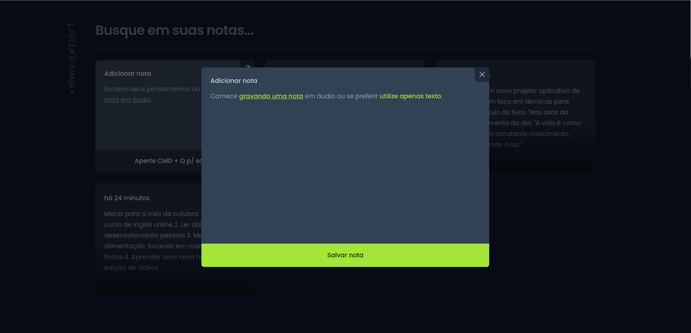
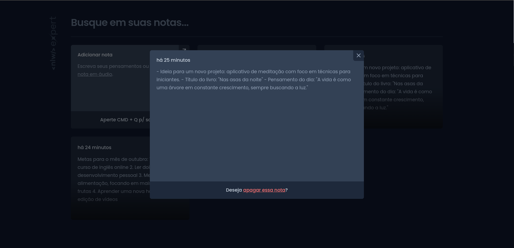

<h1 align="center" style="font-weight: bold;">vue_my_notes 📝</h1>

<p align="center">
  <a href="#technologies">Technologies</a> • 
  <a href="#started">Getting Started</a> • 
  <a href="#routes">Routes</a> • 
  <a href="#colab">Collaborators</a>
</p>

<p align="center">
    <b>The vue_my_notes app automatically converts audio into text notes. It was developed during the Next Level Week Expert by switching from React to Vue.js and then improved by me.</b>
</p>

<p align="center">
     <a href="https://vue-my-notes.vercel.app/">📱 Visit this Project</a>
</p>

<h2 id="layout">🎨 Layout</h2>

<p align="center">
    
    
</p>

<h2 id="technologies">💻 Technologies</h2>


<h2 id="started">🚀 Getting started</h2>

<h3>Cloning</h3>

```bash
git clone https://github.com/MarlonVictor/vueMyNotes.git
```

<h3>Only in the first entry of the project</h3>

```bash
npm install
```

<h3>Starting</h3>

```bash
npm run dev
```

<div id="routes"></div>

## 📍 Application Routes

| route               | description                                          
|----------------------|-----------------------------------------------------
| <kbd>/</kbd>     | main page where you create and list all notes


<h2 id="colab">🤝 Collaborators</h2>

<table>
  <tr>
    <td align="center">
      <a href="https://github.com/MarlonVictor" target="_blank">
        <br>
        <sub>
          <b>Marlon Victor</b>
        </sub>
      </a>
    </td>
    <td align="center">
      <a href="https://github.com/diego3g" target="_blank">
        <br>
        <sub>
          <b>Diego Fernandes</b>
        </sub>
      </a>
    </td>
  </tr>
</table>

<h2 id="license">License 📃 </h2>

This project is under [MIT](./LICENSE) license